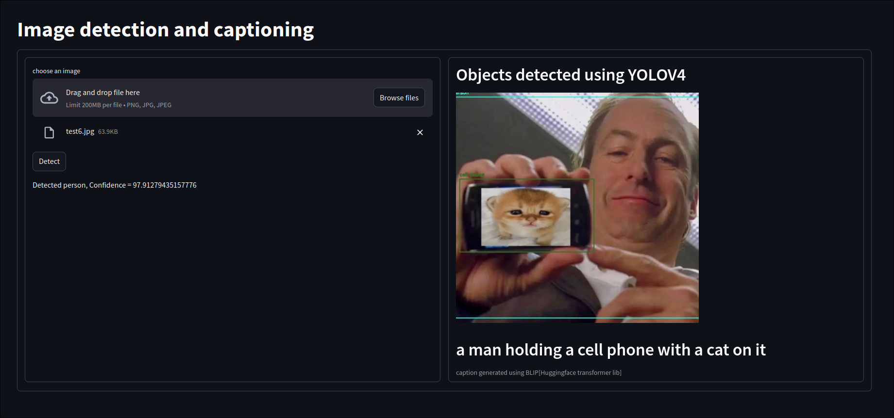

# DetectiNator - Image Detection and Captioning App

A Streamlit web application that performs object detection using YOLOv4 and generates image captions using BLIP transformer model.

## Features

- Upload images for object detection
- Real-time object detection using YOLOv4
- Image captioning using BLIP (Salesforce)
- Clean and intuitive user interface
- Object detection confidence scores
- Automatic image resizing for optimal processing

## Installation

1. Clone the repository:
```bash
git clone <repository-url>
cd DetectiNator
```

2. Install the required dependencies:
```bash
pip install -r requirements.txt
```

Required packages:
- streamlit
- transformers
- PIL
- torch
- cvlib
- opencv-python (cv2)
- numpy

## Usage

1. Run the Streamlit app:
```bash
streamlit run main.py
```

2. Upload an image using the file uploader
3. Click "Detect" to perform object detection
4. View the detected objects with bounding boxes
5. Read the automatically generated caption describing the scene

## How It Works

1. **Image Upload**: Users can upload images in PNG or JPG format
2. **Object Detection**: Uses YOLOv4 model through cvlib to detect common objects
3. **Visualization**: Displays detected objects with bounding boxes
4. **Captioning**: Generates descriptive captions using BLIP transformer model
5. **Display**: Shows both the annotated image and generated caption

## Technical Details

- **Object Detection**: YOLOv4 (via cvlib)
- **Image Captioning**: BLIP (Salesforce/blip-image-captioning-base)
- **Frontend**: Streamlit
- **Image Processing**: OpenCV
- **Deep Learning**: PyTorch

## Requirements

- Python 3.7+
- Adequate RAM for model inference
- GPU recommended for faster processing
- Internet connection for model downloads

## Limitations

- Supports only static image processing
- Limited to common object detection
- Requires stable internet for first-time model downloads

## License
